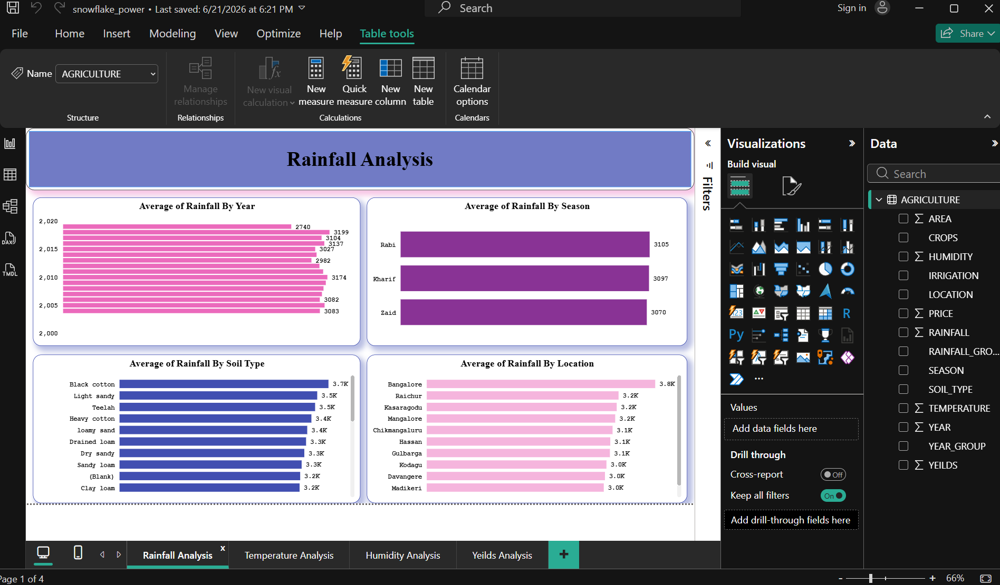
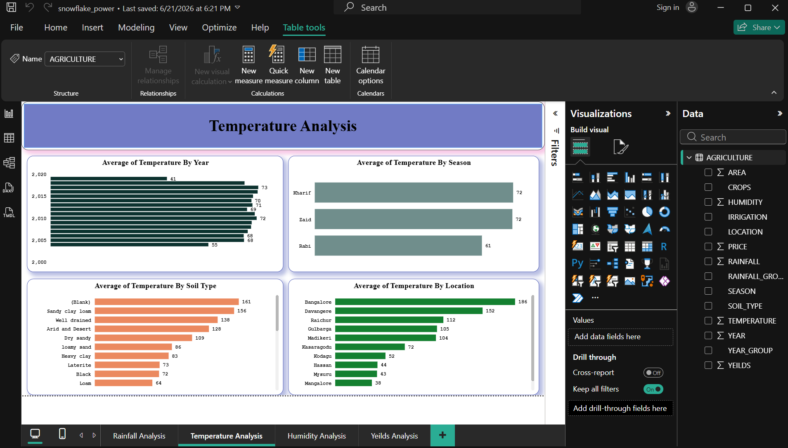
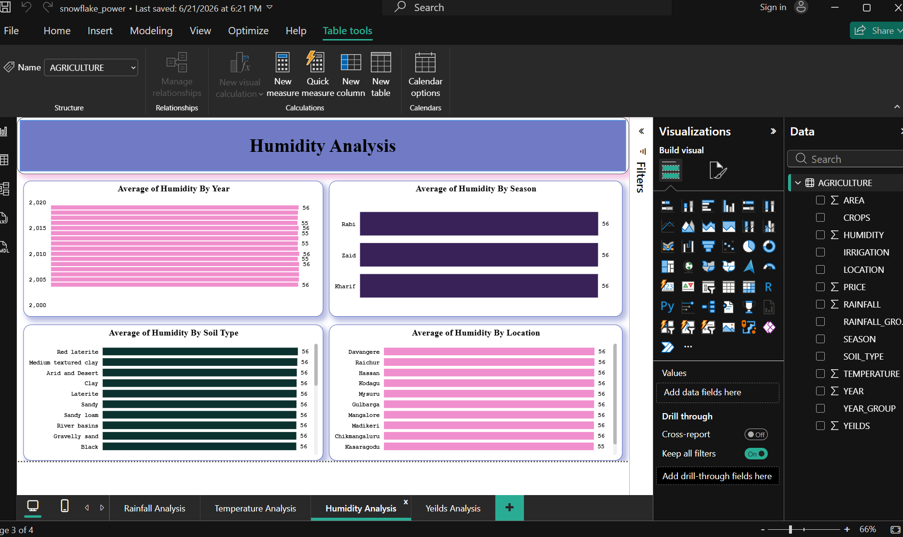
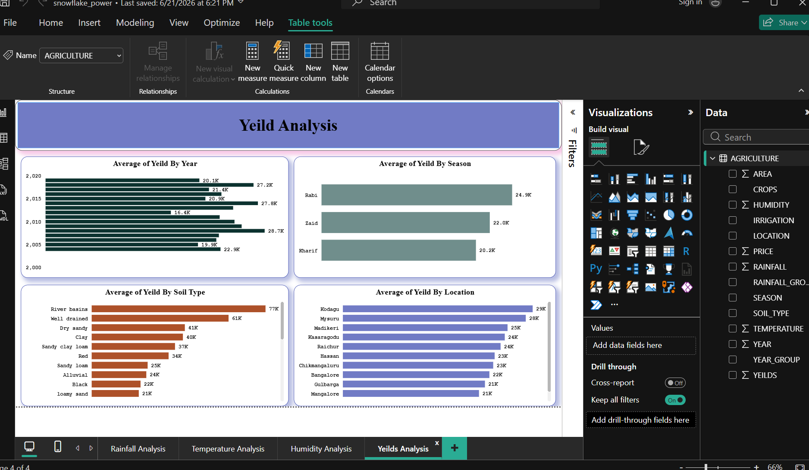

# Agriculture-Data-Analysis---Snowflake-Power-BI
This project focuses on analyzing agriculture-related data using Snowflake as a cloud data warehouse and Microsoft Power BI for interactive data visualization.  The objective of this project is to transform raw agriculture data into meaningful business ins
# Agriculture Data Analysis - Snowflake & Power BI Dashboard

## Project Overview

This project analyzes agriculture data using **Snowflake as a cloud data warehouse** and **Microsoft Power BI for data visualization**.

The dashboard provides insights into agricultural factors such as rainfall, temperature, humidity, and crop yield to understand environmental impact on agricultural performance.

## Tools Used

- Snowflake (Cloud Data Warehouse)
- Microsoft Power BI
- SQL
- Power Query
- DAX
- Data Visualization

## Data Workflow

### 1. Data Storage & Processing
- Loaded agriculture dataset into Snowflake.
- Created and managed tables for analysis.
- Used SQL queries to extract and transform data.

### 2. Data Analysis
- Connected Snowflake with Power BI.
- Built interactive dashboards for agriculture insights.
- Created KPIs and visual reports.

## Dataset Features

The dataset includes:

- Area
- Crops
- Location
- Season
- Soil Type
- Rainfall
- Temperature
- Humidity
- Irrigation
- Price
- Yield
- Year

# Dashboard Analysis

## 1. Rainfall Analysis

Analysis performed:

- Average rainfall by year
- Rainfall trends by season
- Rainfall comparison by soil type
- Location-wise rainfall analysis

Insights:
- Identified rainfall patterns across different years.
- Compared rainfall variations among regions and seasons.
- Studied impact of rainfall conditions on agriculture.

---

## 2. Temperature Analysis

Analysis performed:

- Average temperature by year
- Temperature comparison by season
- Temperature analysis by soil type
- Location-wise temperature trends

Insights:
- Analyzed temperature variations over time.
- Compared temperature behavior across agricultural regions.

---

## 3. Humidity Analysis

Analysis performed:

- Average humidity by year
- Humidity analysis by season
- Humidity comparison by soil type
- Location-wise humidity analysis

Insights:
- Studied humidity distribution across different areas.
- Identified environmental patterns affecting agriculture.

---

## 4. Yield Analysis

Analysis performed:

- Average yield by year
- Yield comparison by season
- Yield analysis by soil type
- Location-wise yield performance

Insights:
- Identified high-performing regions.
- Compared crop yield based on soil and seasonal conditions.
- Analyzed agricultural productivity trends.

---

## Dashboard Features

- Interactive Power BI visuals
- Year and location-based analysis
- Environmental factor comparison
- Agriculture performance tracking

## Dashboard Preview

## Conclusion

This project demonstrates an end-to-end analytics workflow:

**Snowflake Data Warehouse → SQL Analysis → Power BI Dashboard → Agricultural Insights**

It showcases skills in cloud data platforms, SQL, Power BI, and data visualization.
